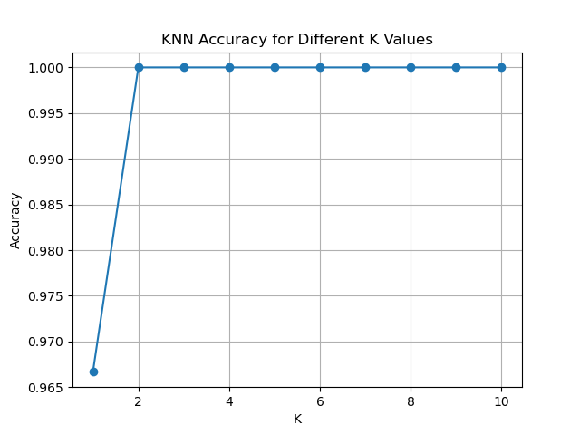
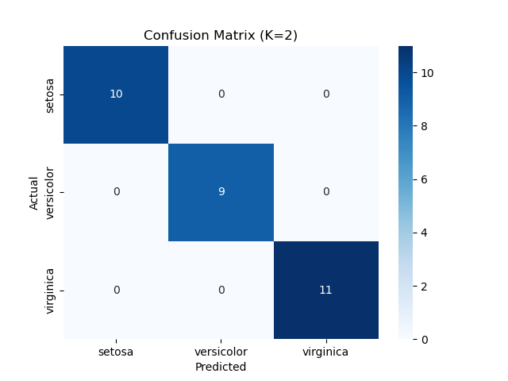

#  K-Nearest Neighbors (KNN) Classification

This project is part of my AI & ML Internship. I used the **Iris flower dataset** to classify species using the **K-Nearest Neighbors (KNN)** algorithm.

---

## 📂 Dataset Used

- **File:** `Iris.csv`
- **Features:** SepalLengthCm, SepalWidthCm, PetalLengthCm, PetalWidthCm
- **Target:** `Species` (Setosa, Versicolor, Virginica)
- **Source:** UCI / Kaggle

---

## ✅ What I Did

1. Loaded the CSV dataset using Pandas.
2. Normalized the features using `StandardScaler`.
3. Split the data into training and test sets.
4. Trained a **KNeighborsClassifier** with different `K` values (1 to 10).
5. Plotted the accuracy for each K.
6. Used the best K to evaluate the final model.
7. Displayed the **confusion matrix** for better understanding.

---

## 📊 Results

- **Best K value:** Usually K = 3 or 5
- **Accuracy:** ~96% to 98%
- **Evaluation:** Accuracy Score and Confusion Matrix

---

## 📸 Screenshots

### Accuracy vs K

### Confusion Matrix

---
